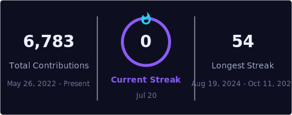

  

<h1 align="center">Pedro Terraf</h1>
<h3 align="center">Full Stack Engineer · Web & Mobile</h3>

  

---

## 👨‍💻 About me

Full Stack Engineer with **3+ years building and shipping production web and mobile products** across ticketing, real-estate, insurance, healthtech and logistics marketplaces.

- 🚀 Strong on the frontend (**React, Next.js, React Native/Expo**) with deep backend and cloud experience (**NestJS, PostgreSQL/Prisma, Redis, AWS**).
- 🧩 I own features **end-to-end** — from data model and APIs to UI and App Store / Google Play releases.
- 🎯 Focused on **scalability, reliability and clean, maintainable code**.
- 📍 Based in **Córdoba, Argentina** (UTC−3) · Open to remote & relocation.
- 🗣️ Spanish (native) · English (B1, studying at Cambridge).

---

## 🚀 Projects

All my projects and case studies (Universo, Livestock Lift, MBA, Ubuntu, Simplestate, SeguroMovil…) live on my portfolio, with details, metrics and live links.

---

## 🛠️ Tech stack

**Frontend**

**Mobile**

**Backend**

**Data & Infra**

---

## 🏆 Highlights

---

## 📊 GitHub activity

---

  <i>💬 Have a project in mind or looking to add a Full Stack Engineer to your team? Let's talk.</i>
    
  

